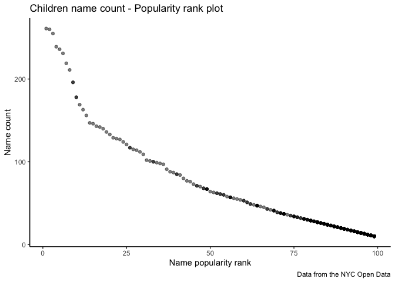

p8105_hw2_CongyangXie
================
Congyang Xie
10/3/2021

# P8105 homework2

``` r
library(tidyverse)
library(readxl)
library(lubridate)
```

## Problem 1

``` r
file_path1 = "Trash-Wheel-Collection-Totals-7-2020-2.xlsx"
```

1.  Read and clean the Mr. Trash Wheel sheet

``` r
MrTrashWheel_df <-
  read_excel(file_path1, sheet = "Mr. Trash Wheel") %>%
  janitor::clean_names() %>%
  select(-x15, -x16, -x17) %>%
  drop_na() %>%
  mutate(sports_balls = round(sports_balls))
```

2.  Read and clean precipitation data for 2018 and 2019.

-   For each, omit rows without precipitation data and add a variable
    for year..

``` r
precip18_df <- 
  read_excel(file_path1, sheet = "2018 Precipitation", skip = 1) %>%
  janitor::clean_names() %>%
  drop_na() %>%
  mutate(year = 2018) %>%
  relocate(year)
  

precip19_df <- 
  read_excel(file_path1, sheet = "2019 Precipitation", skip = 1) %>%
  janitor::clean_names() %>%
  drop_na() %>%
  mutate(year = 2019) %>%
  relocate(year)
```

-   Combine precipitation datasets and convert month to a character
    variable.

``` r
precip_df <- 
  full_join(precip18_df, precip19_df) %>%
  arrange(year, month) %>%
  relocate(year, month) %>%
  mutate(month = month.name[month]) 
```

    ## Joining, by = c("year", "month", "total")

3.  The summary of MrTrashWheel dataset:  

-   The MrTrashWheel dataset has 14 variables and 453 observations. The
    dataset stores trash collect data from each dumpster in the year of
    2014, 2015, 2016, 2017, 2018, 2019, 2020, 2021. The trash type
    includes plastic_bottles, polystyrene, cigarette_butts,
    glass_bottles, grocery_bags, chip_bags, sports_balls. The top3 trash
    types are stated here:

|  skim_variable  | numeric.mean |
|:---------------:|:------------:|
| cigarette_butts |  24521.678   |
|   polystyrene   |   1920.921   |
| plastic_bottles |   1898.929   |

The top3 trash types

-   The median number of sports balls in a dumpster in 2019 is 9.

4.  The summary of precipitation data:

-   The precipitation dataset has 3 variables and 24 observations. The
    variables are: year, month, total. The dataset stores trash
    precipitation data on a monthly basis collected from 2018 to 2019.
    The mean monthly precipitation for 2018 is stated below:

| year | mean_month_precip |
|:----:|:-----------------:|
| 2018 |     5.860833      |

mean monthly precipitation for 2018

-   The total precipitation in 2018 is 70.33

## Problem 2 Merge FiveThirtyEight datasets into 1 dataframe.

1.  clean the data in pols-month.csv.

``` r
pols_df <-
  read_csv("fivethirtyeight_datasets/pols-month.csv") %>%
  janitor::clean_names() %>%
  # Use separate() to break up the variable mon into integer variables year, month, and day
  separate(mon, c("year", "month", "day"), sep = "-") %>%
  mutate(year = as.integer(year),
         # replace month number with month name
         month = month.name[as.integer(month)],
         day = as.integer(day),
         president = ifelse(prez_dem == 1, "dem", "gop")) %>%
  select(-starts_with("prez"), -day)
```

2.  clean the data in snp.csv

``` r
snp_df <-
  read_csv("fivethirtyeight_datasets/snp.csv") %>%
  janitor::clean_names() %>%
  mutate(date = mdy(date)) %>%
  # Use separate() to break up the variable date into integer variables year, month, and day
  separate(date, c("year", "month", "day"), sep = "-") %>%
  mutate(# replace month number with month name
    month = month.name[as.integer(month)],
    day = as.integer(day),
    year = as.integer(year)) %>%
  arrange(year, month) %>%
  relocate(year, month) %>%
  select(-day)
```

3.  tidy the unemployment data so that it can be merged with the
    previous datasets

``` r
unemployment_df <-
  read_csv("fivethirtyeight_datasets/unemployment.csv") %>%
  pivot_longer(cols = 2:13,
               names_to = "month",
               values_to = "unemployment rate") %>%
  janitor::clean_names() %>%
  # convert month from abbreviation to full
  mutate(month = month.name[match(month, month.abb)])
```

4.  Join the datasets by merging snp into pols, and merging unemployment
    into the result

``` r
final_df <- 
  left_join(pols_df, snp_df, by = c("year", "month")) %>%
  left_join(unemployment_df, by = c("year", "month"))
```

5.  Write a short paragraph about these datasets. Explain briefly what
    each dataset contained, and describe the resulting dataset
    (e.g. give the dimension, range of years, and names of key
    variables).

-   The pols dataset has 9 variables and 822 observations, containing
    the number of national politicians who are democratic or republican
    at time ranging from 1947 to 2015. The variables in the dataset are:
    year, month, gov_gop, sen_gop, rep_gop, gov_dem, sen_dem, rep_dem,
    president.

-   The snp dataset has 3 variables and 787 observations, containing
    Standard & Poor’s stock market index (S&P) at time ranging from 1969
    to 2068.The variables in the dataset are: year, month, close.

-   The unemployment dataset has 3 variables and 816 observations,
    containing unemployment rate at time ranging from 1948 to 2015. The
    variables in the dataset are: year, month, unemployment_rate.

-   The final dataset is merged by the 3 datasets above, which has 11
    variables and 822 observations, containing the number of national
    politicians who are democratic or republican, S&P, and unemployment
    rate at time ranging from 1947 to 2015. The variables in the dataset
    are: year, month, gov_gop, sen_gop, rep_gop, gov_dem, sen_dem,
    rep_dem, president, close, unemployment_rate.

## Problem 3

1.  Load and tidy dataset popular baby names.

``` r
popular_baby_names_df <- 
  read_csv("Popular_Baby_Names.csv") %>%
  janitor::clean_names() %>%
  mutate(
    ethnicity = recode(
      ethnicity,
      "BLACK NON HISP" = "BLACK NON HISPANIC",
      "WHITE NON HISP" = "WHITE NON HISPANIC",
      "ASIAN AND PACI" = "ASIAN AND PACIFIC ISLANDER"
    ),
    childs_first_name = toupper(childs_first_name)
  ) %>%
  distinct()
```

2.  create tabel showing the rank in popularity of the name “Olivia” as
    a female baby name over time.

``` r
# the rank in popularity of the name “Olivia” as a female baby name over time
popular_baby_names_df %>%
  filter(childs_first_name == "OLIVIA" & gender =="FEMALE") %>%
  arrange(year_of_birth) %>%
  select(-childs_first_name, -count) %>%
  pivot_wider(names_from = year_of_birth, values_from = rank) %>%
  knitr::kable(caption = "the rank in popularity of the name “Olivia” as a female baby name over time", align = "c")
```

| gender |         ethnicity          | 2011 | 2012 | 2013 | 2014 | 2015 | 2016 |
|:------:|:--------------------------:|:----:|:----:|:----:|:----:|:----:|:----:|
| FEMALE | ASIAN AND PACIFIC ISLANDER |  4   |  3   |  3   |  1   |  1   |  1   |
| FEMALE |     BLACK NON HISPANIC     |  10  |  8   |  6   |  8   |  4   |  8   |
| FEMALE |          HISPANIC          |  18  |  22  |  22  |  16  |  16  |  13  |
| FEMALE |     WHITE NON HISPANIC     |  2   |  4   |  1   |  1   |  1   |  1   |

the rank in popularity of the name “Olivia” as a female baby name over
time

3.  create table showing the most popular name among male children over
    time.

``` r
# the most popular name among male children over time
popular_baby_names_df %>%
  filter(gender =="MALE" & rank == 1) %>%
  select(-count) %>%
  arrange(year_of_birth) %>%
  pivot_wider(names_from = year_of_birth, values_from = childs_first_name) %>%
  knitr::kable(caption = "the most popular name among male children over time", align = "c")
```

| gender |         ethnicity          | rank |  2011   |  2012  |  2013  |  2014  |  2015  |  2016  |
|:------:|:--------------------------:|:----:|:-------:|:------:|:------:|:------:|:------:|:------:|
|  MALE  | ASIAN AND PACIFIC ISLANDER |  1   |  ETHAN  |  RYAN  | JAYDEN | JAYDEN | JAYDEN | ETHAN  |
|  MALE  |     BLACK NON HISPANIC     |  1   | JAYDEN  | JAYDEN | ETHAN  | ETHAN  |  NOAH  |  NOAH  |
|  MALE  |          HISPANIC          |  1   | JAYDEN  | JAYDEN | JAYDEN |  LIAM  |  LIAM  |  LIAM  |
|  MALE  |     WHITE NON HISPANIC     |  1   | MICHAEL | JOSEPH | DAVID  | JOSEPH | DAVID  | JOSEPH |

the most popular name among male children over time

4.  For male, white non-hispanic children born in 2016, produce a
    scatter plot showing the number of children with a name (y axis)
    against the rank in popularity of that name (x axis).

``` r
plt_df <- popular_baby_names_df %>%
  filter(gender == "MALE" &
           ethnicity == "WHITE NON HISPANIC" &
           year_of_birth == 2016) 
# scatter plot
ggplot(plt_df, aes(x = rank, y = count)) +
  geom_point(alpha = .5)+
  labs(
    title = "Children name count - Popularity rank plot",
    x = "Name popularity rank",
    y = "Name count",
    caption = "Data from the NYC Open Data"
  ) +
  theme_classic() + 
  theme(legend.position = "bottom")
```

<!-- -->
